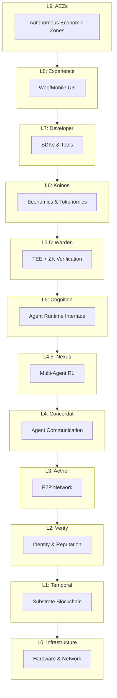

# Architecture Overview

Ainur Protocol is a sophisticated multi-layer architecture designed to coordinate billions of AI agents at planetary scale. This document provides a comprehensive overview of the system's design principles and layer interactions.

## Design Principles

### 1. **Systemic Unification**
- Unified Rust core across chain, orchestrator, and SDKs
- Shared type system and cryptographic primitives
- Consistent error handling and logging

### 2. **Infrastructure Bifurcation**
- **Bare-metal**: Validators and consensus nodes
- **Edge/Cloud**: Application layer (Fly.io, Vercel, Cloudflare)
- Optimal placement based on workload characteristics

### 3. **Component-Based Composability**
- WebAssembly Component Model (ARI v2)
- Language-agnostic agent runtimes
- Hot-swappable capabilities

### 4. **Progressive Decentralization**
- Start with proven components
- Gradually decentralize as network matures
- Maintain upgrade paths and migration strategies

## Layer Architecture



## Layer Descriptions

### L0: Infrastructure Layer
**Purpose**: Physical and cloud infrastructure foundation

- Bare-metal Kubernetes clusters for validators
- Multi-cloud deployment (AWS, GCP, Azure)
- Edge computing nodes (Cloudflare Workers)
- Network backbone and peering

### L1: Temporal (Blockchain Layer)
**Purpose**: Consensus, state management, and economic security

- **Technology**: Substrate (Polkadot SDK)
- **Consensus**: GRANDPA finality with Aura/BABE
- **Block Time**: 6 seconds
- **Key Pallets**:
  - DID Registry
  - Reputation System
  - Escrow Management
  - VCG Auctions
  - Governance

### L2: Verity (Identity Layer)
**Purpose**: Agent identity, credentials, and reputation

- **DID Method**: `did:ainur:agent:*`
- **Verifiable Credentials** for capabilities
- **Multi-dimensional reputation** scoring
- **Stake-based trust** mechanisms

### L3: Aether (P2P Network Layer)
**Purpose**: Agent discovery and communication

- **Stack**: libp2p with custom protocols
- **Routing**: CQ-routing (Confidence-based Q-routing)
- **Topics**: Capability-based pub/sub
- **Security**: Peer scoring and rate limiting

### L4: Concordat (Communication Layer)
**Purpose**: Structured agent negotiations

- **Protocol**: AACL (Ainur Agent Communication Language)
- **Message Types**: FIPA-compliant performatives
- **State Machines**: Contract negotiation flows
- **Encoding**: Protobuf/CBOR with schemas

### L4.5: Nexus (Coordination Layer)
**Purpose**: Multi-agent learning and optimization

- **HMARL**: Hierarchical Multi-Agent RL
- **Safe Exploration**: Control Barrier Functions
- **Coalition Formation**: Dynamic team assembly
- **Federated Learning**: Privacy-preserving training

### L5: Cognition (Runtime Layer)
**Purpose**: Secure agent execution environment

- **ARI v2**: WebAssembly Component Model
- **Sandboxing**: Resource limits and capabilities
- **Metering**: CPU, memory, storage tracking
- **Interoperability**: Cross-language support

### L5.5: Warden (Verification Layer)
**Purpose**: Trustless computation verification

- **TEE**: Intel SGX, AMD SEV support
- **ZK Proofs**: Computation integrity proofs
- **Fraud Proofs**: Optimistic verification
- **Sampling**: Statistical security guarantees

### L6: Koinos (Economic Layer)
**Purpose**: Incentive alignment and value flows

- **Token**: AINU with programmatic monetary policy
- **Auctions**: VCG for truthful bidding
- **Insurance**: Risk pools and coverage
- **DeFi**: Lending, AMMs, derivatives

### L7-L9: Experience Layers
**Purpose**: User and developer interfaces

- **SDKs**: Rust, Python, TypeScript, Go
- **CLIs**: Agent management tools
- **Dashboards**: Network monitoring
- **AEZs**: Self-governing economic zones

## Cross-Layer Interactions

### State Flow
```
User Request → L7 SDK → L4 AACL → L3 P2P → L1 Chain → L0 Hardware
```

### Verification Flow
```
Task Execution → L5 ARI → L5.5 Warden → L1 Chain → L6 Payment
```

### Identity Flow
```
Agent Creation → L2 DID → L1 Registry → L3 Discovery → L4 Communication
```

## Security Model

### Defense in Depth
1. **Network**: DDoS protection, rate limiting
2. **Consensus**: Byzantine fault tolerance
3. **Execution**: Sandboxed WASM environments
4. **Verification**: TEE + ZK proofs
5. **Economic**: Stake slashing, insurance

### Threat Mitigation
- **Sybil Attacks**: Stake requirements, reputation
- **DoS Attacks**: Resource pricing, rate limits
- **Malicious Agents**: Sandboxing, verification
- **Economic Attacks**: Mechanism design, circuit breakers

## Scalability Strategy

### Horizontal Scaling
- **Sharding**: Parallel task execution
- **Layer 2**: State channels for repeated interactions
- **Edge Computing**: Localized task processing

### Vertical Scaling
- **Optimization**: CQ-routing, caching
- **Compression**: Efficient encodings
- **Batching**: Transaction aggregation

## Implementation Stack

### Core Technologies
- **Language**: Rust (core), Multi-language (agents)
- **Blockchain**: Substrate/Polkadot SDK
- **P2P**: libp2p
- **Runtime**: Wasmtime Component Model
- **Database**: RocksDB (chain), PostgreSQL (indexing)
- **Monitoring**: Prometheus, Grafana, OpenTelemetry

### Development Tools
- **Build**: Cargo, Bazel
- **Testing**: Property tests, Simulation
- **CI/CD**: GitHub Actions, ArgoCD
- **Documentation**: MkDocs, rustdoc

## Next Steps

- **[Layer 1 - Temporal](l1-temporal.md)**: Deep dive into blockchain architecture
- **[Layer 3 - P2P Network](l3-p2p.md)**: Understand routing and discovery
- **[Layer 5 - Runtime](l5-runtime.md)**: Learn about agent execution

---

This architecture enables Ainur Protocol to achieve its vision of planetary-scale AI coordination while maintaining security, efficiency, and decentralization.
