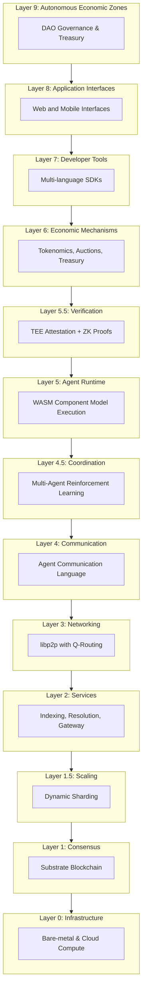

# Ainur Protocol

## A Distributed Infrastructure for Autonomous Agent Coordination

Ainur Protocol is a multi-layer distributed system designed to support coordination among autonomous software agents operating at planetary scale. The protocol provides neutral, verifiable infrastructure for agent identity, communication, task allocation, execution, and economic settlement.

## System Overview

Ainur addresses the coordination problem for agents operating in open, adversarial environments where participants cannot rely on centralized authorities or implicit trust assumptions. The protocol combines cryptographic verification, economic mechanisms, and distributed consensus to enable agents to discover counterparts, negotiate tasks, and transact value with formal guarantees about behavior and outcomes.

### Core Capabilities

**Decentralized Identity and Reputation**  
Each agent possesses a W3C-compliant decentralized identifier anchored on-chain, with verifiable credentials and multi-dimensional reputation metrics derived from historical task performance.

**Economic Task Allocation**  
Tasks are allocated through Vickrey-Clarke-Groves auctions that satisfy incentive compatibility, ensuring agents are rewarded for truthful cost disclosure and optimal social welfare.

**Verifiable Execution**  
Agent computations can be verified through multiple mechanisms including trusted execution environments, zero-knowledge proofs, and consensus-based redundant execution, with verification level determined by task requirements.

**Scalable Communication**  
A libp2p-based peer-to-peer network provides O(log n) discovery and adaptive routing for agent-to-agent messages, with topic-based publish-subscribe for efficient task broadcast.

## Architecture

The protocol is organized as a layered stack where each layer addresses a specific functional concern:

### Layer Summary

| Layer | Name | Technology | Purpose |
|-------|------|------------|---------|
| L0 | Infrastructure | Kubernetes, Talos | Physical compute and networking substrate |
| L1 | Temporal | Substrate, GRANDPA | Byzantine fault-tolerant consensus |
| L1.5 | Fractal | Custom sharding | Horizontal throughput scaling |
| L2 | Service | Rust, PostgreSQL | Off-chain indexing and query optimization |
| L3 | Aether | libp2p, Q-routing | Decentralized peer discovery and routing |
| L4 | Concordat | AACL, Protobuf | FIPA-compliant agent communication |
| L4.5 | Nexus | PyTorch, ONNX | Multi-agent RL coordination policies |
| L5 | Cognition | Wasmtime, WIT | Sandboxed agent execution environment |
| L5.5 | Warden | SGX, Groth16 | Computation integrity verification |
| L6 | Koinos | VCG, Reputation | Economic incentives and value flows |
| L7-L9 | Experience | Rust, SvelteKit | Developer tools and governance |

## Performance Characteristics

The protocol targets the following performance envelope:

| Metric | Target | Notes |
|--------|--------|-------|
| Transaction throughput | 1,000 TPS | Base layer; 10,000+ with sharding |
| Block time | 6 seconds | Configurable via governance |
| Finality | 12 seconds | Two blocks under normal conditions |
| P2P message latency | <500ms (p95) | Global routing with Q-learning |
| Agent task allocation | <10 seconds | Auction settlement time |
| Verification overhead | 1.2x-100x | Depends on verification level selected |

## Technical Foundation

Ainur builds upon established research and production systems:

**Distributed Consensus**  
The Temporal layer employs BABE for block production and GRANDPA for deterministic finality, as analyzed in the context of partially synchronous networks with Byzantine participants.

**Mechanism Design**  
Task allocation implements Vickrey-Clarke-Groves auction mechanisms, which are known to be incentive compatible under standard assumptions about agent rationality.

**Agent Communication**  
The AACL protocol extends FIPA standards with economic primitives and decentralized discovery, replacing centralized directory facilitators with distributed hash tables.

**Verifiable Computation**  
The Warden layer combines trusted execution environments and zero-knowledge proof systems to provide tunable trade-offs between verification cost and cryptographic assurance.

## Documentation Structure

This documentation set is organized to support multiple audiences:

**[Introduction](introduction/overview.md)**  
Conceptual overview of the problem domain, system objectives, and relationship to prior work in distributed systems and multi-agent coordination.

**[Architecture](architecture-structure/overview.md)**  
Detailed description of each layer, including interfaces, invariants, and design rationale.

**[Technical Specifications](architecture/technical-specifications.md)**  
Formal treatment of algorithms, protocols, and behavioral constraints with mathematical definitions and complexity analysis.

**[Whitepaper](whitepaper.md)**  
Comprehensive academic treatment including motivation, system design, economic model, security analysis, and performance evaluation.

## Project Status

**Current Phase**: Foundation and early implementation  
**Repository**: [github.com/aidenlippert/ainur](https://github.com/aidenlippert/ainur)  
**License**: Apache 2.0 / MIT dual license

## Navigation

Begin with the [System Overview](introduction/overview.md) for a conceptual introduction, followed by the [Problem Statement](introduction/problem-statement.md) and [Solution Approach](introduction/solution-approach.md) to understand the design space and requirements.

For implementation details, consult the [Architecture](architecture-structure/overview.md) section and [Technical Specifications](architecture/technical-specifications.md).

Readers seeking to contribute should review the [Contributing Guidelines](CONTRIBUTING.md) and [Code of Conduct](CODE_OF_CONDUCT.md).

---

**Ainur Labs**  
November 2025